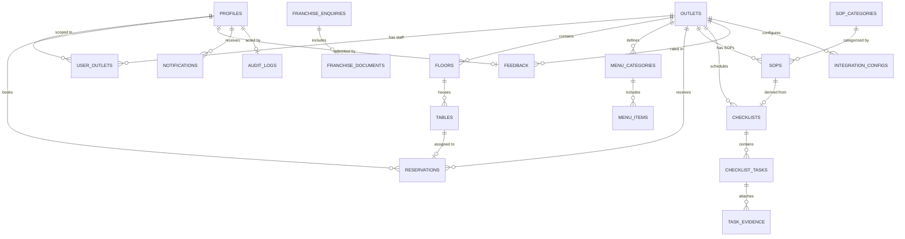

# Mayflower Phase 1 Entity Relationship Diagram (ERD)

## Entity Summary Table
| Entity | Module | Description | RLS State |
|---|---|---|---|
| `profiles` | Identity | User roles, contact info, status (extends `auth.users`) | Default Deny |
| `user_outlets` | Identity | Outlet assignment join table | Default Deny |
| `outlets` | Outlets | Restaurant outlets, operating hours, status | Default Deny |
| `floors` | Outlets | Floor levels per outlet | Default Deny |
| `tables` | Outlets | Physical dining tables, capacity, position | Default Deny |
| `menu_categories` | Menu | Food/beverage categories | Default Deny |
| `menu_items` | Menu | Dishes, pricing, availability | Default Deny |
| `reservations` | Reservations | Guest bookings & table assignment status | Default Deny |
| `sop_categories` | Operations | Standard operational categories | Default Deny |
| `sops` | Operations | Standard Operating Procedures | Default Deny |
| `checklists` | Operations | Scheduled operational checklists | Default Deny |
| `checklist_tasks` | Operations | Specific tasks with priority and due date | Default Deny |
| `task_evidence` | Operations | Uploaded photo/geo metadata evidence | Default Deny |
| `feedback` | Feedback | Guest ratings and comments | Default Deny |
| `franchise_enquiries`| Franchise | Franchise application leads | Default Deny |
| `franchise_documents`| Franchise | Applicant documents | Default Deny |
| `integration_configs`| Integrations | Petpooja, Loyalty, CCTV adapter configs | Default Deny |
| `notifications` | System | Multi-channel notification queue | Default Deny |
| `audit_logs` | System | Material action log | Default Deny |
